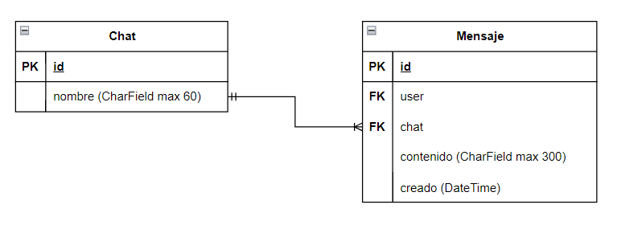

Inove Escuela de Código\
info@inove.com.ar\
Web: [Inove](http://inovecode.com)

---
# Proyecto

Este proyecto tiene la finalidad de poner en práctica todos los conceptos adquiridos en el curso:
- Crear un proyecto y configurarlo
- Crear los modelos de datos
- Crear las APIs
- Crear los serializadores
- Crear las vistas

Este proyecto lo comenzará usted desde cero, para alcanzar los objetivos planteados en este enunciado.

Utilice Postman o una interfaz equivalente para evaluar su progreso a medida que avance, pytest y el sistema de desafios para ir realizando las entregas hasta culiminar exitosamente la realización de este trabajo.

Si tiene dudas, puede utilizar los canales de comunicación del curso para debatir sobre la realización de este proyecto.

__NOTA__: No es exclusivamente necesario utilizar docker ni PosgreSQL. Puede utilizar docker si así lo prefiere (ya cuenta con el archivo de docker-compose y DockerFile en este repositorio) o puede instalar Django en su PC y las librerías necesarias incluidas en requirements.txt.

---

## Objetivos a alcanzar
Su objetivo será crear una aplicación de chats, en la cual su sistema administrará distintos chats en los cuales usuarios podrán escribir en ellos mensajes. Al finalizar tendrá un aplicación de manejo y uso de chats de mensajes que podrá continuar perfeccionando (agregando roles, permisos, etc) en un futuro si lo desea.

### 1. Crear el proyecto "chatapp"
Crear el proyecto chatapp utilizando los comandos de Django para tal fin.

### 2. Crear la aplicación "canales"
Crear la aplicación "canales" utilizando los comandos de Django para tal fin.

### 3. Configurar los archivos de test y pytest
Dentro de este repositorio encontrará tres archivos:
- pytest.ini
- pytest_fixtures.py
- tests.py

---

- pytest.ini --> Este archivo es la configuración de pytest, lo debe copiar dentro de la carpeta del proyecto "chatapp" a la misma altura que se encuentra manage.py. Puede observar otros repositorios de ejemplos de clase como referencia de dónde debe ser colocado este archivo.

- pytest_fixtures.py --> Este archivo contiene funciones de ayuda que se utilizan en los tests, lo debe copiar dentro de la carpeta del proyecto "chatapp" a la misma altura que se encuentra manage.py. Puede observar otros repositorios de ejemplos de clase como referencia de dónde debe ser colocado este archivo.

- tests.py --> Este archivo contiene los tests a ejecutar, lo debe copiar dentro de la carpeta "canales" reemplazando el archivo original "tests.py" que se encuentra allí. Puede observar otros repositorios de ejemplos de clase como referencia de dónde debe ser colocado este archivo.


### 4. Configuraciones del proyecto
- Configurar la librería DRF. Para este proyecto deberá utilizar como mecanismo de autenticación "TokenAuthentication" con permisos "IsAuthenticated".
- Configurar la base de datos, copiando el siguiente código en settings.py (en el lugar adecuado) a fin de que el sistema de desafios sea capaz de seleccionar SQLIte en vez de PosgreSQL llegado el momento (puede observar otros repositorios de ejemplo de clase como referencia)
```
if os.getenv("DB_ENGINE") == "POSTGRES":

    # NOTE: Reemplazamos la configuración inicial de base de datos para trabajar con Postgres:
    # Recordemos:
        #   POSTGRES_DB: chatapp_db
        #   POSTGRES_USER: usuario
        #   POSTGRES_PASSWORD: password

    DATABASES = {
        'default': {
            # 'ENGINE': 'django.db.backends.postgresql_psycopg2' --> En desuso.
            'ENGINE': 'django.db.backends.postgresql',
            'NAME': 'chatapp_db',       # POSTGRES_DB
            'USER' : 'usuario',         # POSTGRES_USER
            'PASSWORD' : 'password',    # POSTGRES_PASSWORD
            'HOST':'db',                # Nombre del servicio
            'PORT': '5432'              # Número del puerto
        }
    }

else:
    DATABASES = {
        'default': {
            'ENGINE': 'django.db.backends.sqlite3',
            'NAME': BASE_DIR / 'db.sqlite3',
        }
    }

```
- Configurar nuestra nueva aplicación "canales". NO debe incluir esta aplicación dentro de ninguna otra carpeta adicional (como puede ser apps, aplicaciones, applications, etc).

### 5. Implementar el modelo de datos
Deberá implementar el modelo de datos de su proyecto siguiendo el siguiente esquema:



__IMPORTANTE:__
- Debe respectar los nombres de las tablas y los nombres de los campos del diagrama, en caso contrario los tests no funcionarán.
- El campo "creado", del tipo de dato DateTime en la tabla "Mensajes", deberá utilizar una característica especial. Django deberá almacenar automaticamente el momento/tiempo de creación de una fila en el campo creado, no deberá ser asignado por usted en código al construir un objeto Mensajes. Investigue como puede realizarse aquello con Django.

### 6. Realizar las migraciones del sistema.
Realizar las migraciones de la aplicación y crear un nuevo superusuario. De esta forma podrá ingresar al Django Admin y validar que los modelos de datos han sido creados como se espera. Juegue un poco y valide usted mismo que los modelos pueden crearse en el administrador sin inconvenientes.

### 7. Endpoints
Sus endpoints deberán ser administrados por la aplicación creada "canales", siguiendo las siguientes pautas:
- Todos los endpoints de esta aplicación comenzarán con "/api/..."
- Puede crear los endpoints de la manera que más cómodo le resulte (función api_view, APIVIew, viewsets, GenericView, etc) siempre y cuando cumplan con los requerimientos del endpoint.
- No importa que método escoja para crear su API, debe utilizar serializadores para la serialización de datos.
- En cada caso se le especificará como se deben retornar los datos (si debe filtrarlos, si debe paginarlos, etc)
- No es necesario que coloque un nombre (name) particular a los endpoints, lo importante es que la ruta del endpoint coincida con lo que se solicita en el enunciado.

__IMPORANTE:__ Es importante que usted pruebe los endpoints en su computadora, utilizando Postman o cualquier otra interfaz que le resulte cómoda, a fin de validar que los mismos funcionan como se espera y poder detectar posibles fallas con mayor facilidad.

### 8. Endpoint `/api/canales/chats/`
Deberá construir un endpoint que responda a la URL `/api/canales/chats/`:
- Este endpoint deberá soportar los métodos POST, GET y PUT. 

A continuación se detalla como cada una de las peticiones interactúa con el endpoint, usted puede decidir resolverlo todo en una sola vista (sería lo aconsejable) o crear más de una.

__[POST]__ `/api/canales/chats/`
- El endpoint en esta petición recibe unicamente el campo "nombre" y con ello deberá generarse un nuevo chat.
- Ejemplo del payload JSON que debe enviarse para generar un nuevo chat de ejemplo:
```
{
    "nombre": "Chat nuevo"
}
```
- Cómo resultado deberá crearse dicho nuevo chat con el nombre especificado en la base de datos, y el reponse deberá contener los datos del chat creado. Ejemplo de un response esperado:
```
{
    "id": 2,
    "nombre": "Chat nuevo"
}
```


__[GET]__ `/api/canales/chats/`
- El endpoint en esta petición deberá retornar una lista de JSON con los todos los chats serializados en su aplicación, especificando el ID y el nombre de cada chat.
- Ejemplo de un response esperado:
```
[
    {
        "id": 1,
        "nombre": "Michat 1"
    },
    {
        "id": 2,
        "nombre": "Chat nuevo"
    }
]
```

__[GET]__ `/api/canales/chats/<pk>/`
- El endpoint en esta petición deberá retornar un único chat en JSON, aquel que corresponda al pk pasado por la URL como parámetro. El JSON serializado deberá especificar el ID y el nombre del chat en cuestión.
- Ejemplo de un response esperado para `/api/canales/chats/2/`:
```
{
    "id": 2,
    "nombre": "Chat nuevo"
}
```

__[PUT]__ `/api/canales/chats/<pk>/`
- El endpoint en esta petición deberá actualizar el chat que corresponda al pk pasado por la URL como parámetro.
- Ejemplo del payload JSON enviado a `/api/canales/chats/2/` para actualizar el nombre del chat 2:
```
{
    "nombre": "Chat actualizado"
}
```
- Cómo resultado deberá actualizarse dicho chat con el nombre especificado en la base de datos, y el reponse deberá contener los datos del chat actualizado. Ejemplo de un response esperado en este caso:
```
{
    "id": 2,
    "nombre": "Chat actualizado"
}
```

### 9. Endpoint `/api/canales/mensajes/`
Deberá construir un endpoint que responda a la URL `/api/canales/mensajes/`:
- Este endpoint deberá soportar los métodos POST y GET.
- La petición `GET` que retornará la lista de mensajes, debe estar paginada.

A continuación se detalla como cada una de las peticiones interactúa con el endpoint, usted puede decidir resolverlo todo en una sola vista (sería lo aconsejable) o crear más de una.

__[POST]__ `/api/canales/mensajes/`
- El endpoint en esta petición recibe el campo "chat" (el id del chat), "user" (el id del user) y "contenido" del mensaje.
- Ejemplo del payload JSON que debe enviarse para generar un nuevo mensaje de ejemplo:
```
{
    "chat": 1,
    "user": 2,
    "contenido": "Hola usuario 2"
}
```
- Cómo resultado deberá crearse dicho nuevo mensaje con los datos especificados en la base de datos, y el reponse deberá contener los datos del mensaje creado. Ejemplo de un response esperado:
```
{
    "id": 1,
    "user": 2,
    "chat": 1,
    "contenido": "Hola usuario 2",
    "creado": "2023-12-11T23:23:47.648271Z"
}
```


__[GET]__ `/api/canales/mensajes/`
- El endpoint en esta petición deberá retornar una lista de JSON con los todos los mensajes serializados y __paginados__ en su aplicación.
- Ejemplo de un response esperado:
```
{
    "count": 3,
    "next": null,
    "previous": null,
    "results": [
        {
            "id": 1,
            "user": 2,
            "chat": 1,
            "contenido": "Hola usuario 2",
            "creado": "2023-12-11T23:23:47.648271Z"
        },
        {
            "id": 2,
            "user": 3,
            "chat": 1,
            "contenido": "Hola usuario 1, ¿Cómo estás?",
            "creado": "2023-12-11T23:24:01.870097Z"
        },
        {
            "id": 3,
            "user": 2,
            "chat": 2,
            "contenido": "Mensaje nuevo",
            "creado": "2023-12-11T23:24:23.640146Z"
        }
    ]
}
```

### 10. Endpoint `/api/chats/<chat_id>/mensajes/`
Deberá construir un endpoint que responda a la URL `/api/chats/<chat_id>/mensajes/`:
- Este endpoint deberá soportar el método GET.


__[GET]__ `/api/chats/<chat_id>/mensajes/`
- El endpoint en esta petición deberá retornar una lista de JSON con los todos los mensajes serializados para un determinado chat_id pasado por parámetro en la URL.
- Ejemplo de un response esperado para `/api/chats/1/mensajes/`:
```
[
    {
        "id": 1,
        "user": 2,
        "chat": 1,
        "contenido": "Hola usuario 2",
        "creado": "2023-12-11T23:23:47.648271Z"
    },
    {
        "id": 2,
        "user": 3,
        "chat": 1,
        "contenido": "Hola usuario 1, ¿Cómo estás?",
        "creado": "2023-12-11T23:24:01.870097Z"
    }
]
```

### 11. Endpoint `/api/chats/<chat_id>/mensajes/<username>/`
Deberá construir un endpoint que responda a la URL `/api/chats/<chat_id>/mensajes/<username>/`:
- Este endpoint deberá soportar el método GET.


__[GET]__ `/api/chats/<chat_id>/mensajes/<username>/`
- El endpoint en esta petición deberá retornar una lista de JSON con los todos los mensajes serializados para un determinado chat_id y un determinado username (nombre de usuario) pasado por parámetro en la URL.
- Ejemplo de un response esperado para `/api/chats/1/mensajes/juan/`:
```
[
    {
        "id": 1,
        "user": 2,
        "chat": 1,
        "contenido": "Hola usuario 2",
        "creado": "2023-12-11T23:23:47.648271Z"
    }
]
```

## ¡Hora de evaluar nuestro código!
Puede evaluar que ha alcanzo los solicitado en el desafio ejecutando los tests que vienen dentro la carpeta ejercicios_practica dónde ha estando incoporando su código. Para eso debe realizar los siguientos:

1 - Abrir una consola dentro de la carpeta ejercicios_practica

2 - Lanzar el docker de ejercicios_practica (si es que está usando docker):\
**$** `docker-compose up`

3 - Abrir una nueva consola

4 - Ingresar su consola dentro del contenedor con el siguiente comando (si es que está usando docker):\
**$** `docker exec -it chatapp_api bash`

5 - Lance los tests con el siguiente comando:\
**$** `pytest -s`

---

## ¿Dudas?
Ante cualquier inquietud, debe referirse a los canales especificados para su trato en inove.
